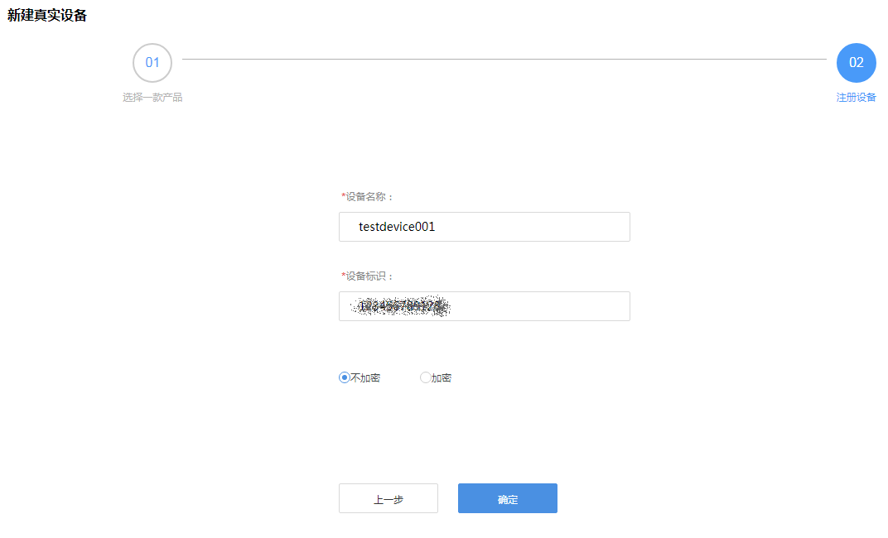
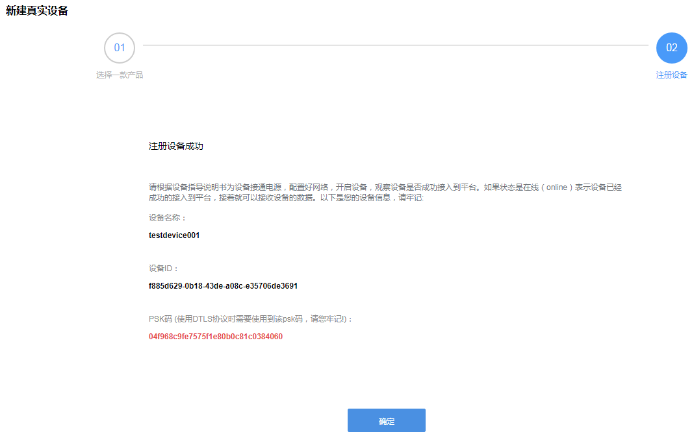
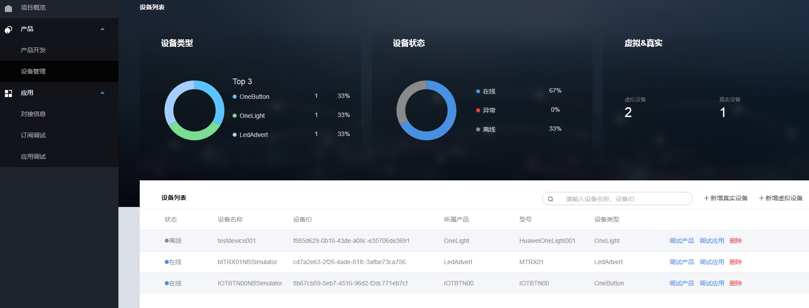
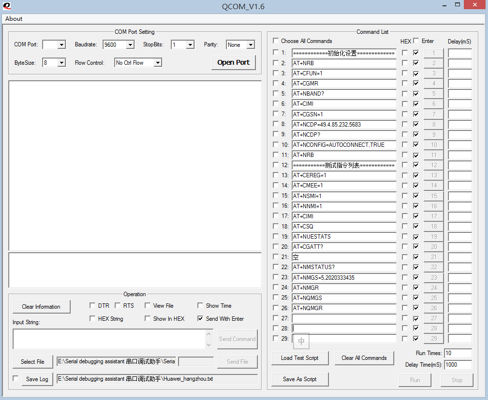
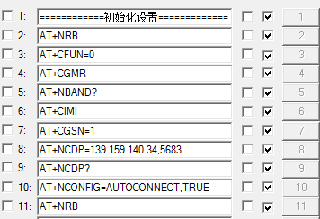
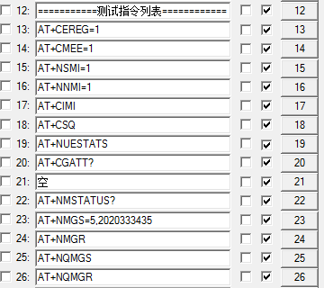

# 使用NB-IoT对接OceanConnect平台

[[toc]]  

## 注册NB-IoT设备

- 点击右上角“新增真实设备”。准备注册一个真实的NB-IoT设备。


::: warning 注意
此处设备标识码要填写NB-IoT模块的IMEI号。有2个方法获取IMEI号，可以从模块上直接看到，也可以通过AT指令读出来。（推荐使用AT指令读取的方式，下面有具体操作方法）  
:::  







## 指令解析

::: tip 说明
AT指令详细内容，请参阅NB模块用户手册。
:::  

| 指令 |	描述 |
| ----  |   ---- |
| AT+NRB | 模块重启Reboot |
| AT+CFUN=0 | 设置终端射频功能 =0 最小功能 =1 完整功能 |
| AT+CGMR |	查询制造商版本 |
| AT+NBAND? | 查询频段 5（电信850MHz）8（移动和联通900MHz） |
| AT+CGSN=1 | 查询产品序列号 =1 返回IMEI号 |
| AT+NCDP=49.4.85.232,5683 | 配置CDP服务器设置（IP和端口号） |
| AT+NCDP? | 查询CDP服务器设置 |
| AT+NCONFIG=AUTOCONNECT,TRUE |	配置模块行为（上电或重启后自动连入网络） |
| AT+CEREG=1 | 查询网络注册状态 =1 网络注册自动回复 =0 禁用网络注册自动回复 |
| AT+CMEE=1 | 报告移动终端错误 =1 启用，返回详细错误码 =0 禁用，统一返回ERROR |
| AT+NSMI=1 | 发送消息标志 =0 不显示 =1 显示发送结果 |
| AT+NNMI=1 | 新消息标志 =0 不显示 =1 显示标示和数据 |
| AT+CIMI |	查询国际移动设备身份码 |
| AT+CSQ |	获取信号强度 |
| AT+NUESTATS |	获取模块状态（含SNR、CELLID） |
| AT+CGATT? | PS连接或分离 =0 分离 =1 附着 |
| AT+NMSTATUS? | 信息注册状态 |
| AT+NMGS=5,2020373839 |	发消息 |
| AT+NMGR |	接收消息 |
| AT+NQMGS | 查询发送消息统计 |
| AT+NQMGR | 查询接受消息统计 |

- AT+NMGS 发消息。根据NB模块用户手册，例如：你想往IoT云平台发送789这个数据，需要根据OceanConnect平台上编解码插件的定义进行转换。插件中规定的长度为5，所以上报时要补上两个空格，得到（‘ ’，‘ ’，‘7’，‘8’，‘9’）这5个字节数据。字符'9'所对应的16进制ASCII码为0x39。然后通过串口发送 AT+NMGS=05,2020373839 ，模块返回：OK。则此包数据发送成功。

- AT+NMGR 接收消息。根据NB模块用户手册，例如：IoT云平台给NB模块下发了命令，你可以通过串口发送 AT+NMGR，模块返回：2，4F4E  OK。那么需要将（‘4’，‘F’，‘4’，‘E’）这4个字节数据，在程序中组装为（'ON'）这2个字节。0x4F这个16进制对应的ASCII码是'O'。则此包数据接收成功。

## 动手操作NB-IoT连接OceanConnect平台

- 这部分内容是：通过电脑串口调试软件，手动发AT指令，直接发给NB-IoT模块。NB模块返回的信息，直接到电脑串口调试软件。一步一步动手操作，实现连接OceanConnect平台。

### NB开发板硬件接线

::: warning 注意
注意下图中红圈的位置。尤其注意 P1 短接端子，要将CH的RX短接到NB的TX，CH的TX短接到NB的RX。  
:::  


- 登陆网盘，下载串口调试软件 Serial debugging assistant 。链接：https://pan.baidu.com/s/1qdbxR2MlUxfDI01bX4q27g     密码：dbfe



- 波特率：9600。串口号根据电脑实际情况选择。

- AT指令第一部分：初始化设置。此部分命令（序号2-11）只需要设置一次。



#### 命令2 发：AT+NRB

```  
REBOOTING
H?
Boot: Unsigned
Security B.. Verified
Protocol A.. Verified
Apps A...... Verified

REBOOT_CAUSE_APPLICATION_AT
Neul 
OK
```

#### 命令3 发：AT+CFUN=0
```
	OK
```  

#### 命令4 发：AT+CGMR 

::: warning 注意
此模块为657SP1版本，模块没有内置IMEI号。需要手动写入IMEI号。IMEI号在模块上可以找到。如果是657SP2及后续版本，模块已经内置IMEI号，不必写入IMEI号。  
:::  

```
SSB,V150R100C10B200SP1
SECURITY_A,V150R100C20B300SP2
PROTOCOL_A,V150R100C20B300SP2
APPLICATION_A,V150R100C20B300SP2
SECURITY_B,V150R100C20B300SP2
RADIO,Hi2115_RF1
OK  
```

#### 命令5 发：AT+NBAND?

```
+NBAND:5,8,3,28,20,1

OK
```

#### 命令6 发：AT+CIMI 
::: warning 注意
查询国际移动设备身份码IMSI。区分本条命令与命令7。
:::  

```
460111175090234

OK
```

#### 命令7 发：AT+CGSN=1 
::: tip 说明
可以直接通过此命令，读取IMEI号。  
:::  

```  
	+CGSN:867726031076062
	
	OK  
```

#### 命令8 发：AT+NCDP=49.4.85.232,5683  
::: warning 注意
若是其他华为云平台，请修改为相应IP和端口号。  
:::  
```  
	OK
```  

#### 命令9 发：AT+NCDP?

    ```
	+NCDP:49.4.85.232,5683
	
	OK
    ```

#### 命令10 发：AT+NCONFIG=AUTOCONNECT,TRUE
```
	OK
```  

- **AT指令第二部分**：测试指令列表。此部分命令（序号13-26）如果NB模块重启后，需要设置一遍。



#### 命令13 发：AT+CEREG=1
```
	OK
```  

#### 命令14 发：AT+CMEE=1  
::: warning 注意
此处打开详细错误代码功能。不开启的话，若出现问题则统一返回ERROR。  
:::  
```
	OK
```  

#### 命令15 发：AT+NSMI=1
```
	OK
```  

#### 命令16 发：AT+NNMI=1
```
	OK
```  

#### 命令17 发：AT+CIMI
```
	460111175090234
	
	OK
```  

#### 命令18 发：AT+CSQ
```
	+CSQ:18,99
	
	OK
```  

#### 命令19 发：AT+NUESTATS
```
	Signal power:-819
	Total power:-761
	TX power:230
	TX time:1144
	RX time:76193
	Cell ID:125414482
	ECL:0
	SNR:234
	EARFCN:2509
	PCI:226
	RSRQ:-108
	OPERATOR MODE:4
	
	OK
```  

#### 命令20 发：AT+CGATT?
```
	+CGATT:1
	
	OK
```  

#### 命令21 空白

#### 命令22 发：AT+NMSTATUS?  
::: warning 注意
此命令用于测试NB模块与IoT平台的连接情况。第一次通过AT+NMGS命令发送上报数据时，若返回513错误 “+CME ERROR: 513”，则需要查询AT+NMSTATUS?，直到模块返回+NMSTATUS:MO_DATA_ENABLED，表示NB模块与IoT平台已经连接。
:::  

```
	+NMSTATUS:MO_DATA_ENABLED
	
	OK
```  

#### 命令23 发：AT+NMGS=5,2020333435  
::: tip 说明
上报数据：345  
:::  

```
	OK
	
	+NSMI:SENT
```  

#### 命令24 发：AT+NMGS=5,2020373839 
::: tip 说明
上报数据：789  
:::  

```
	OK
	
	+NSMI:SENT
```  

#### 命令25 发：AT+NQMGS
```
	PENDING=0,SENT=2,ERROR=0
	
	OK
```  

#### 命令26 发：AT+NQMGR
```
	BUFFERED=0,RECEIVED=0,DROPPED=0
	
	OK
```  

### NB-IoT与OceanConnect云平台联合调试

#### 命令23 发：AT+NMGS=5,2020333435  
::: tip 说明
上报数据：345。  
:::  

- 此时可以在OceanConnect平台，查看真实NB设备，已经上线ONLINE。点击设备，进去查看历史数据。


- 此时在串口调试软件中，命令AT+NQMGS，命令AT+NQMGR 可以查看已发送消息统计、已接收消息统计。


### OceanConnect平台下发命令到NB-IoT模块

由于NB-IoT模块的PSM省电模式，OceanConnect平台不会立即下发命令，而是等待NB-IoT模块上发一条数据后，此时才会将缓存在云平台上的命令下发。所以，在测试IoT云平台下发命令功能时，每次下发命令前，需要先通过NB模块上发一条数据。  

具体操作是：通过串口调试软件，发送AT+NMGS=5,202033343